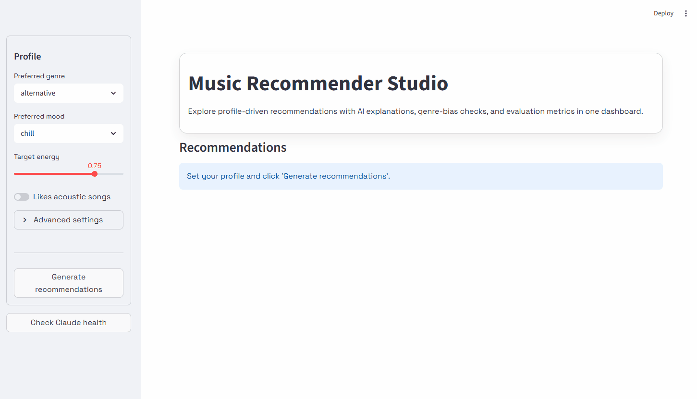

# Music Recommender Studio

## Original Project - Module 3: Music Recommender

This project builds on the Module 3 Music Recommender, a rule-based system that scores songs against a user taste profile across four weighted features: genre, mood, energy, and acousticness. The original system produced ranked recommendations and deterministic text explanations, but had no AI-generated reasoning, no bias awareness, and no evaluation metrics. This final version extends that foundation into a full applied AI system.

---

## Title and Summary

**Music Recommender Studio** is a profile-driven music recommendation system that combines deterministic scoring with AI-generated explanations, bias detection, and evaluation metrics, all surfaced through an interactive Streamlit dashboard.

Users define a taste profile (preferred genre, mood, energy level, and acoustic preference), and the system scores every song in a real Spotify catalog, ranks the top matches, flags potential genre-bias in the scoring, and uses Claude (Anthropic's AI model) to generate a plain-English explanation for each recommendation. Evaluation metrics (genre diversity, score spread, and feature balance) are computed and displayed after every run.

The system matters because it demonstrates how transparency and guardrails can be built into an AI pipeline: every recommendation is explainable, every bias is surfaced, and every failure is handled without breaking the user experience.



---

## Architecture Overview

```
User Profile + Spotify Catalog
        ↓
   Scoring Engine          (genre ×0.30, mood ×0.25, energy ×0.25, acoustic ×0.20)
        ↓
   Bias Detection          (flags genre contribution > 50% of total score)
        ↓
   Top-K Ranking
        ↓
   AI Explanation          (Claude Haiku via Anthropic API, with rule-based fallback if unavailable)
        ↓
   Evaluation Metrics      (diversity, spread, feature balance)
        ↓
   Streamlit Dashboard     (cards + breakdown bars + Spotify player + metrics chart)
```

See [diagram](assets/diagrams/diagram.png) for the full system diagram.

The pipeline is retrieval-augmented: before Claude generates an explanation, it receives the song metadata, the weighted score breakdown, the rule traces, and any bias warning as structured context. Claude's output is grounded in that retrieved data and cannot invent features that are not there. If the API is unavailable, the system falls back to deterministic rule-based text so recommendations always display.

---

## Setup Instructions

### 1. Clone the repository

```bash
git clone https://github.com/CarlosSac/applied-ai-system-final
cd applied-ai-system-final
```

### 2. Create and activate a virtual environment

```bash
python -m venv .venv

# Windows
.venv\Scripts\activate

# Mac / Linux
source .venv/bin/activate
```

### 3. Install dependencies

```bash
pip install -r requirements.txt
```

### 4. Add your Anthropic API key

Create a `.env` file in the project root:

```
ANTHROPIC_API_KEY=your_api_key_here
```

Get a key at [console.anthropic.com](https://console.anthropic.com).

### 5. Prepare the song catalog

Download the Spotify Tracks Dataset from Kaggle (`maharshipandya/spotify-tracks-dataset`) and place the CSV in `data/`. Then run:

```bash
python data/prepare_spotify.py --input data/dataset.csv --output data/songs.csv --limit 500
```

This samples up to 500 songs evenly across all genres and derives mood from valence and energy.

### 6. Run the CLI

```bash
python -m src.main
```

### 7. Run the Streamlit UI

```bash
streamlit run src/ui.py
```

### 8. Run tests

```bash
pytest
```

---

## Sample Interactions

### Example 1 - High-Energy Pop (genre + mood match, no bias)

**Profile:** genre=pop, mood=happy, energy=0.90, likes_acoustic=False

**Output:**

```
#1  Levitating – Dua Lipa
    Score : 0.93
    Why   : This track was selected with a score of 0.93, driven by a strong
            genre match with pop and a mood alignment with your happy preference.
            The high energy level of 0.88 closely matches your target of 0.90,
            contributing significantly to the overall score.
```

**Metrics:** Diversity: 0.33 | Spread: 0.041 | Top feature: genre (34%)

---

### Example 2 - Ghost Genre (genre not in catalog, bias detected)

**Profile:** genre=metal, mood=intense, energy=0.92, likes_acoustic=False

**Output:**

```
#1  Killing in the Name – Rage Against the Machine
    Score : 0.50
    Why   : This song scored 0.50 primarily because of its intense mood alignment
            and high energy match at 0.91. Note: genre contributes 60% of the
            total score, exceeding the 50% threshold. This recommendation relies
            heavily on genre similarity rather than a balanced mix of features.

    ⚠ Bias warning: genre contributes 60% of total score (threshold 50%).
```

**Metrics:** Diversity: 1.00 | Spread: 0.217 | Top feature: genre (60%)

---

### Example 3 - Chill Lofi (balanced scoring, low spread)

**Profile:** genre=lofi, mood=chill, energy=0.35, likes_acoustic=True

**Output:**

```
#1  Snowfall – Øneheart
    Score : 0.91
    Why   : Snowfall earns a high score of 0.91 through strong alignment across
            all four features: genre, chill mood, low energy, and
            high acousticness, resulting in a well-balanced recommendation
            without over-reliance on any single attribute.
```

**Metrics:** Diversity: 0.67 | Spread: 0.028 | Top feature: acoustic (24%)

---

## Design Decisions

**Why deterministic scoring instead of a learned model?**
Transparency was the priority. Every score is fully traceable to a weighted sum with no hidden embeddings or black-box outputs. This makes bias detection straightforward: if genre contributes more than 50% of the total score, the system can flag it and communicate it clearly.

**Why Claude for explanations?**
The explanation module follows a RAG pattern: structured context (score breakdown, rule traces, bias signal) is retrieved and injected into a prompt before Claude generates a response. This keeps Claude grounded and unable to fabricate features, while producing natural language that is more readable than template strings.

**Why a fallback?**
API availability is not guaranteed. The system always produces output. If Claude is unreachable or over quota, the deterministic fallback generates a readable explanation from the rule traces. This makes the system production-reliable without requiring a live API connection.

**Why sample evenly across genres?**
The original catalog had 15 hand-crafted songs. The Kaggle dataset is sorted alphabetically by genre, so a naive `--limit 200` would return only acoustic songs. The `prepare_spotify.py` script groups by genre and samples evenly to ensure catalog diversity, which directly affects diversity metrics and recommendation quality.

**Trade-offs made:**

- Fixed weights mean users cannot express that they care more about energy than genre. A future version could expose weight sliders.
- Mood is derived from valence and energy thresholds, not labeled by humans. Edge cases exist.
- One Claude API call per recommendation means 3 songs = 3 sequential requests. This is slow but keeps the code simple and the cost low.

---

## Testing Summary

**10 out of 10 automated tests pass.** The scoring engine, bias detection (flagged and non-flagged cases), fallback explanation generator, and all three evaluation metrics are covered. The system uses four reliability mechanisms: automated unit tests (`pytest`), weighted score breakdowns that act as confidence indicators for each recommendation, `print`-based error logging that surfaces API failures instead of hiding them, and a startup health check that diagnoses API key issues before any recommendations run.

**What worked:**

- All 10 pytest tests pass, covering scoring logic, bias detection (both flagged and non-flagged cases), fallback explanation generation, and all three evaluation metric functions.
- The bias detection correctly flags genre-heavy recommendations and injects the warning into Claude's prompt, which then surfaces it in plain English.
- The health check at startup reliably diagnoses API key issues before running recommendations.
- Progressive rendering in the UI (one card at a time as Claude responds) significantly improves perceived performance.

**What did not work initially:**

- Gemini API (original provider) had a quota limit of 0 on the free tier; the project switched to Anthropic Claude.
- Silent exception handling in `generate_explanation` hid all API errors. Adding diagnostic print statements immediately identified the issue.
- Streamlit's `st.markdown` strips JavaScript, so Plotly charts cannot be embedded via `to_html()`; replaced with pure CSS/HTML progress bars for the in-card breakdown.
- Newlines in Claude's response broke the HTML card structure; fixed by stripping newlines before inserting explanation text into HTML.

**What was learned:**

- LLM outputs require sanitization before embedding in HTML: special characters, markdown formatting (`**bold**`), and newlines all need handling.
- Caching (`@st.cache_data`) masks data updates; after regenerating the CSV, the Streamlit cache must be cleared manually.
- The "reliability" requirement is met not just by tests but by the combination of health checks, fallback logic, bias guardrails, and evaluation metrics working together.

---

## Reflection

Building this project made the gap between "correct by the formula" and "actually useful" very concrete. The scoring rules are transparent and traceable, but that transparency also exposes their limits: a user who wants high-energy folk gets a song that matches genre and mood but directly contradicts their energy target, because genre and mood together outweigh the energy penalty. The system is honest about this through the bias detection, but honesty does not fix the underlying limitation.

Integrating Claude changed how the explanations feel without changing what the system knows. The AI did not add new information; it received the same breakdown the rule-based fallback uses, but communicated it in a way that felt more human and contextually aware. AI here is an interface layer, not the reasoning layer. The reasoning is the scoring logic. Keeping those two roles separate made the system easier to test, easier to debug, and easier to trust.

The most important lesson was about guardrails. Every failure mode that surfaced (quota errors, empty API responses, JavaScript stripping, encoding issues, stale caches) had a visible symptom only because diagnostic output was added. Silent failures are the hardest problems to debug.

## About

**What this project says about me as an AI engineer?**
Building this project taught me that integrating AI into a system is the easy part, knowing where it belongs is the real skill. I used a retrieval-augmented generation pattern: before Claude generates any explanation, the system retrieves the score breakdown, rule traces, and bias signal and hands that to the model as grounded context. Claude is not guessing. It is translating data that already exists into language a user can read. That separation between deterministic reasoning on one side, and language generation on the other is what made the system testable and trustworthy.

The other thing this project says about me: I take failure modes as seriously as features. Every guardrail in this system (the bias flag, the health check, the fallback, the diagnostic logging) exists because a silent failure once made the app look correct when it had never called the AI at all. I want to build systems that are honest about what they know, what they cannot do, and when something has gone wrong.

[](https://www.loom.com/share/6477834a2afa4db682791411fb1cf2cb)
